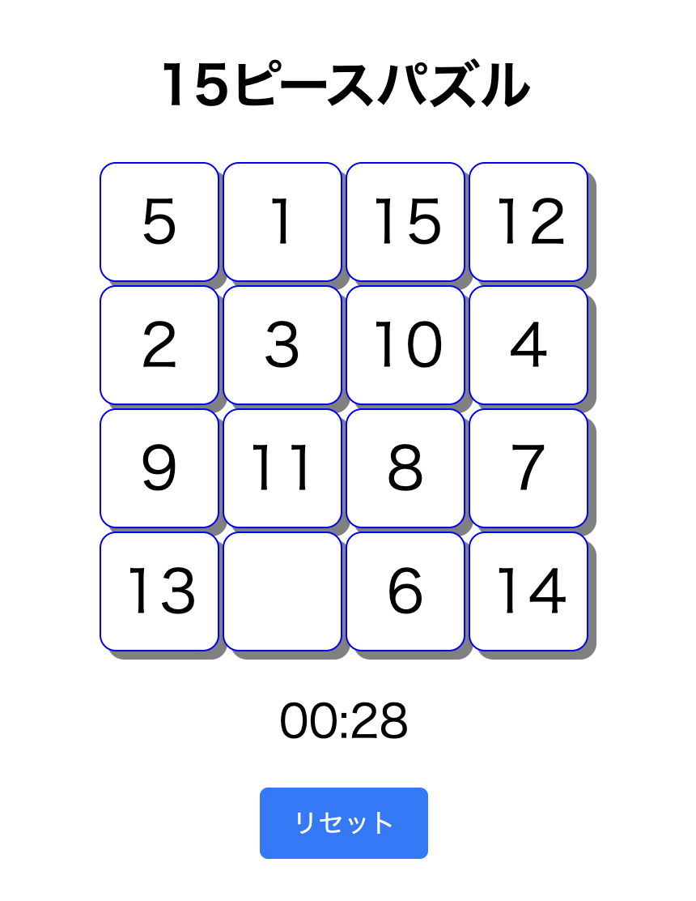

# デモ


https://chiharakenta.github.io/ts-15-puzzles/

# バージョン情報
- node.js v24.11.1

# ビルド手順
1. ビルド
    ```
    git clone https://github.com/chiharakenta/ts-15-puzzles.git
    cd ts-15-puzzles
    npm run dev
    ```
2. http://localhost:5173/ts-15-puzzles/ にアクセス